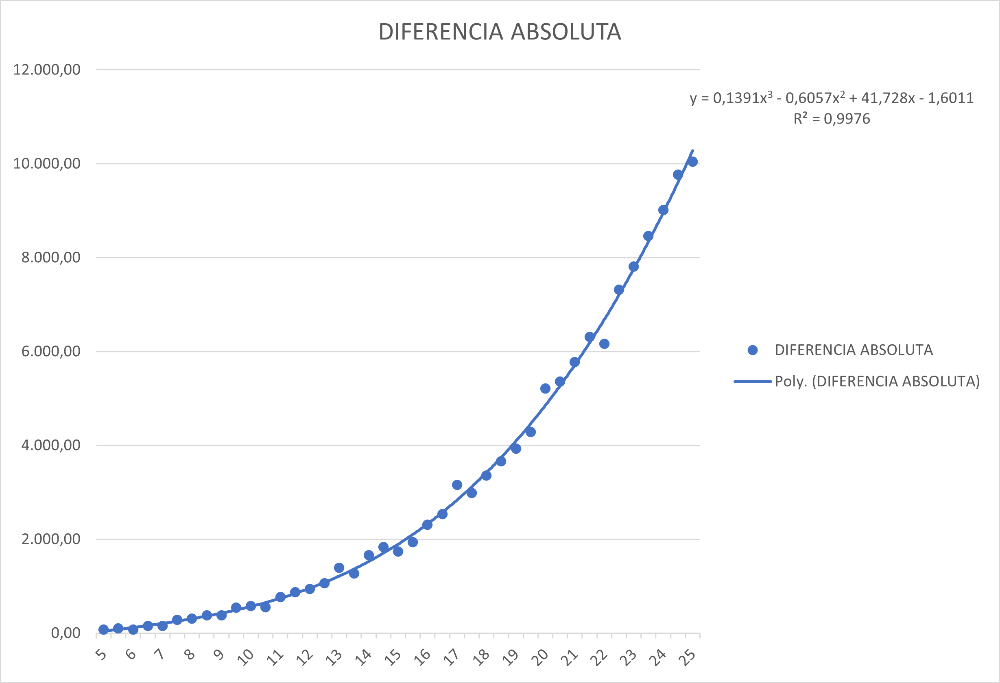
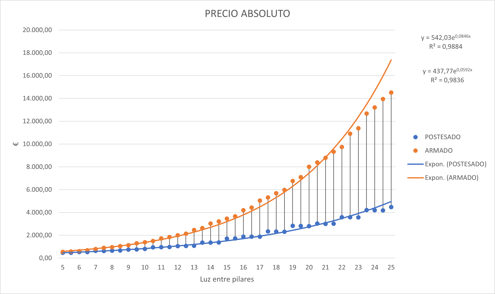

# Is post-tensioned concrete so unaffordable ?

## Comparison between reinforced and post-tensioned elements under transverse loads. Isostatic and continuous elements.

    

This project aims to create a straight forward tool to check if and when post-tensioned concrete elements should be
chosen instead of tradicional reinforced ones. Two files compose the project:

**Beams.py:** In this file all different classes are described, each element constitutes its own class. Those classes are:

* posTensionedIsoBeam
* reinforcedIsoBeam
* posTensionedHiperBeam
* reinforcedHiperBeam
* posTensionedSlab
* reinforcedSlab

Inside each of the classes there are different methods for calculating active and passive reinforcement, checking cracking
and deflections. 

**App.py:** In this file instances of each class are created by length of the element and added into a dictionary. For each element
into the dictionary every method is called and its result stored in order to display all data of every instance in a data frame, so 
each class in Beam.py has its own data frame. 

**main.py:** This file is not used in any useful way yet. From main.py all data frames could be called and exported to excel. 

Once exported different statistical treatment can be made. 
